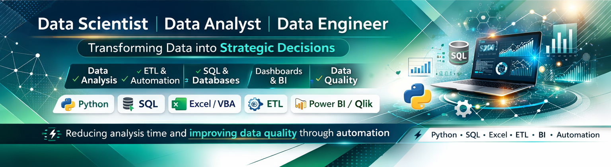

<!-- BANNER -->
<div align="center">
  
</div>

<br/>

<!-- TÍTULO Y PRESENTACIÓN -->
<div align="center">

# Gustavo García Carrillo

### Data Analyst · Business Intelligence · Data Science

*"Transformo datos en decisiones. No solo reportes — insights accionables."*

[](https://linkedin.com/in/ggarciac)
[](mailto:garciacarrillogustavo@gmail.com)
[](https://maps.google.com/?q=Estado+de+Mexico)
[](https://github.com/ggarciac-30)

</div>

---

## 👤 Acerca de mí

Soy un profesional de analítica de datos con casi **9 años de experiencia** en sectores financiero, retail y educación. Me especializo en entender qué ocurre **detrás de los indicadores del negocio**: no solo describo lo que pasó, sino por qué pasó y qué decisión debería tomarse a continuación.

Mi enfoque conecta la ingeniería matemática con la realidad operativa: construyo pipelines de datos, automatizo procesos que consumen tiempo humano innecesariamente, y desarrollo dashboards que realmente se usan.

```python
perfil = {
    "nombre":        "Gustavo García Carrillo",
    "formacion":     "Ingeniero Matemático – IPN (ESFM)",
    "experiencia":   "~9 años en Data Analytics & BI",
    "sectores":      ["Servicios Financieros", "Retail", "Educación"],
    "enfoque":       "Insights accionables, no solo reportes",
    "stack_core":    ["SQL", "Python", "Power BI", "Looker Studio"],
    "superpoder":    "Automatización de pipelines analíticos (–70% tiempo)"
}
```

---

## 🛠️ Stack Tecnológico

### Lenguajes & Análisis


### Business Intelligence & Visualización


### Bases de Datos


### ETL & Automatización


### Data Science & ML


### Herramientas & Control de Versiones


---

## 💼 Experiencia Profesional

<details>
<summary><strong>🏦 BanCoppel – Científico de Datos</strong> <em>(May 2022 – Mar 2025)</em></summary>

**Sector:** Servicios Financieros

Formé parte del equipo de analítica de clientes, trabajando con grandes volúmenes de información para evaluar campañas, entender comportamiento de usuarios y apoyar decisiones comerciales.

**Principales logros:**
- ⚡ Automaticé la validación de datos y la generación de reportes de campañas con SQL y Python, reduciendo en **más del 70%** el tiempo de preparación de análisis
- 🗺️ Definí criterios de segmentación y desarrollé visualizaciones con **mapas de calor** para identificar patrones de comportamiento de clientes
- 🧪 Implementé **pruebas A/B**, análisis estadístico y dashboards de métricas en Looker para evaluar campañas y facilitar seguimiento de KPIs

**Stack:** `SQL` `Python` `Looker` `Análisis Estadístico` `Pruebas A/B` `Segmentación`

</details>

<details>
<summary><strong>🏦 BanCoppel – Analista Sr. Segmentos</strong> <em>(Ene 2022 – Abr 2022)</em></summary>

**Sector:** Servicios Financieros

Analicé bases de datos de clientes para identificar patrones de comportamiento y tendencias entre segmentos, apoyando estrategias comerciales.

**Principales logros:**
- 🎯 Definí criterios de segmentación mediante análisis de patrones para identificar perfiles con mayor afinidad a distintos productos
- 📊 Analicé comportamiento de clientes para apoyar la definición de audiencias objetivo

**Stack:** `SQL` `Python` `Segmentación` `Análisis de Comportamiento`

</details>

<details>
<summary><strong>💄 Avon Cosmetics – Pricing Planner Analyst</strong> <em>(Jul 2020 – Dic 2021)</em></summary>

**Sector:** Retail / Cosmética

Analicé información de precios para un portafolio de **más de 28,000 productos** en mercados de Centroamérica y República Dominicana para evaluar estrategias de pricing y apoyar la planeación de campañas.

**Principales logros:**
- ⚡ Automaticé reportes de pricing con **Excel VBA**, reduciendo en más del **60%** el tiempo de análisis
- 🔧 Desarrollé herramientas analíticas para evaluar tendencias de precios por categoría con **Power Query** y **Power Pivot**

**Stack:** `Excel VBA` `Power Query` `Power Pivot` `SQL` `Análisis de Precios`

</details>

<details>
<summary><strong>🏦 Santander México – Analista Base de Datos</strong> <em>(Dic 2019 – Jul 2020)</em></summary>

**Sector:** Servicios Financieros / Banca

Analicé información operativa y monitoreé eventos asociados a fraude para detectar incidencias y mejorar procesos de seguimiento.

**Principales logros:**
- 🔍 Automaticé el monitoreo de eventos de fraude con **Excel VBA**, mejorando la detección de interrupciones
- 📊 Desarrollé tableros de control en **Power BI** para monitoreo visual y reacción más rápida ante incidencias
- 🔗 Integré información de múltiples fuentes mediante consultas en **Access** para análisis de riesgo

**Stack:** `Excel VBA` `Power BI` `SQL` `Access` `Monitoreo de Fraude`

</details>

<details>
<summary><strong>🎓 Enova México – Especialista de Datos y Procesos</strong> <em>(Mar 2018 – Dic 2019)</em></summary>

**Sector:** Educación / EdTech

Analicé indicadores operativos de programas educativos y desarrollé dashboards para el seguimiento del desempeño de alumnos.

**Principales logros:**
- 📈 Desarrollé dashboards operativos en **Looker Studio** utilizados por **más de 20 usuarios**
- ⚡ Automaticé la generación de reportes con **Excel VBA**, reduciendo en más del **70%** el tiempo de preparación
- 👥 Coordiné el trabajo de un integrante del equipo en el desarrollo de herramientas analíticas

**Stack:** `Looker Studio` `Excel VBA` `SQL` `Reportería Operativa`

</details>

<details>
<summary><strong>🎓 Enova México – Analista de Datos y Procesos</strong> <em>(Nov 2016 – Mar 2018)</em></summary>

**Sector:** Educación / EdTech

Analicé procesos operativos y desarrollé automatizaciones para mejorar la generación de reportes e indicadores de desempeño de alumnos.

**Principales logros:**
- 🤖 Automaticé reportes operativos mediante **macros en Excel VBA** para reducir tareas manuales
- 📊 Desarrollé indicadores operativos para monitorear el progreso de alumnos en cursos

**Stack:** `Excel VBA` `SQL` `Reportería` `Automatización`

</details>

---

## 🚀 Proyectos Destacados

> Los proyectos a continuación reflejan mis habilidades en automatización de datos, análisis de comportamiento y construcción de pipelines analíticos.

| Proyecto | Descripción | Stack |
|---|---|---|
| 🔗 [**linkedin-connections-analyzer**](#) | Pipeline completo de análisis de red profesional en Power Query M con fuzzy matching (Jaccard/Levenshtein) sobre 1,000+ contactos. Incluye clasificación de seniority y activos para LinkedIn carousel. | `Power Query M` `Excel` `Fuzzy Matching` |
| 🔗 [**duplicate-file-detector**](#) | Herramienta CLI en Python para detección de archivos duplicados con SHA-256 hashing. Genera reporte Excel con openpyxl. | `Python` `SHA-256` `openpyxl` `CLI` |
| 🔗 [**campaign-ab-testing-analysis**](#) | Análisis estadístico de pruebas A/B para evaluación de campañas de marketing en servicios financieros. | `Python` `pandas` `scipy` `Estadística` |
| 🔗 [**pricing-analytics-dashboard**](#) | Dashboard y herramientas analíticas para seguimiento de estrategias de precios en portafolio de 28K+ productos. | `Excel VBA` `Power Query` `Power Pivot` |
| 🔗 [**customer-segmentation-analysis**](#) | Análisis de segmentación de clientes con mapas de calor y visualización de patrones de comportamiento. | `Python` `pandas` `matplotlib` `seaborn` |
| 🔗 [**fraud-monitoring-dashboard**](#) | Sistema de monitoreo de eventos de fraude con alertas automáticas y tableros de control en Power BI. | `Power BI` `SQL` `Excel VBA` |

---

## 📊 Estadísticas GitHub

<div align="center">


</div>

<div align="center">


</div>

<div align="center">


</div>

---

## 🎓 Educación y Formación

| Institución | Programa | Estado |
|---|---|---|
| **IPN – ESFM** | Ingeniería Matemática | ✅ Graduado |
| **UNAM – DGTIC** | Diplomado en Administración de Bases de Datos | ✅ Completado |
| **GEM Educa** | Diplomado Internacional en Data Science | 🔄 En curso |
| **Scidata** | Machine Learning con Python | ✅ Completado |
| **IEFPI** | Programación en R | ✅ Completado |
| **Quick Learning** | Inglés – Nivel 6 (Comprensión) | ✅ Completado (2025) |

---

## 🎯 Objetivos Profesionales

Busco roles como **Data Analyst**, **BI Analyst** o **Data Scientist** en organizaciones donde los datos sean parte central de la toma de decisiones. Me interesa especialmente trabajar en:

- 🏦 Sector financiero y fintech — análisis de comportamiento, riesgo y campañas
- 📦 Logística y operaciones — KPIs, dashboards, eficiencia operativa
- 📊 Equipos de analítica con cultura data-driven y enfoque en impacto de negocio

Actualmente profundizando en **Machine Learning aplicado** y construcción de soluciones end-to-end con Python.

---

## 📬 Contacto

<div align="center">

¿Tienes un proyecto de datos, una posición abierta, o simplemente quieres conectar?

[](https://linkedin.com/in/ggarciac)
[](mailto:garciacarrillogustavo@gmail.com)

</div>

---

<div align="center">
  <sub>Actualizado: 2025 · Estado de México, México</sub>
</div>
